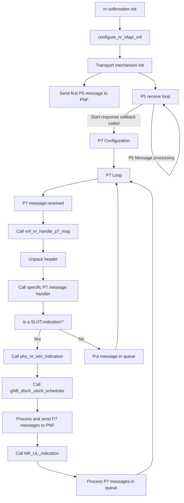
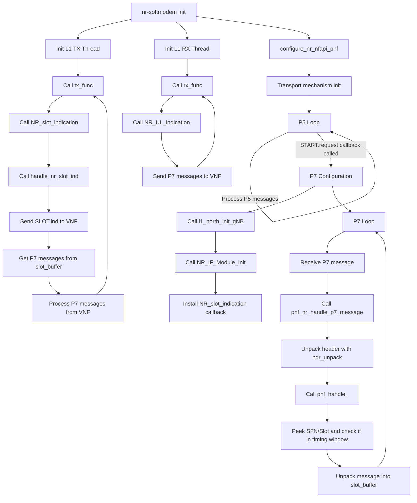

This document describes the broad way in which the VNF and PNF work internally,
from configuration, to P5 and P7 message exchange and processing.
Their internal processing is broadly independent on which transport mechanism
is responsible for exchanging data between the 2 components.

To read more about the transport mechanisms available, and how to run the split, please refer to
[this file](./nfapi.md).

[[_TOC_]]

# VNF/PNF Split

The gNB is split into VNF (L2+) and PNF (L1)

These component are configured via the functions:

- `configure_nr_nfapi_vnf()`
- `configure_nr_nfapi_pnf()`

These functions initialize the configuration appropriate for the transport mechanism selected ( setting the
pack/unpack function pointers, as well as the appropriate send functions )

After this, a thread is created for the P5 receive loop, which initializes the transport and receive loop

This created thread may be only for P5 messages, or P5 and P7, depending on the transport type

- When using socket-based communication (which uses nFAPI encoding), the receiving loop for P7 messages is separate from
  P5, it starts upon the `PNF_START` exchange
- In the other transport mechanisms (WLS and nvIPC, which use FAPI encoding), the receiving loop is the same for P5 and
  P7 messages, the P7 configuration is done immediately after the P5 configuration.

Since the first P7 messages is only sent/received after the START exchange, we can logically treat the loops as separate
, we won't receive P7 messages before finishing the P5 ones ( except for the STOP exchange )

## P5 interface main loop

After the P5 configuration, both the VNF and PNF have a thread waiting to "consume" (n)FAPI messages exchanged between
them

Upon the reception of a message (whether in its entirety or segmented in the case of nFAPI), the messages are sent to
the appropriate handler:

- `pnf_nr_handle_p5_message`
- `vnf_nr_handle_p4_p5_message`

In each of these functions, there's a switch calling the appropriate handler according to the message ID, for example:

```
case NFAPI_NR_PHY_MSG_TYPE_START_RESPONSE:
	vnf_nr_handle_start_response(pRecvMsg, recvMsgLen, config, p5_idx);
	break;
```

These loops are autonomous in their thread waiting incoming message.

## P7 interface main loop

> **Note:** As explained before, the P7 reception loop is the same as the P5 messages when not using socket-based communication

In this case, when the P5 interface receives appropriate message, it starts the p7 interface by launching a thread

- On the PNF, this is done in the START.request handler ( `nr_start_request(...)` )
- On the VNF, this is done in ( `configure_nr_p7_vnf(...)` )

Much in the same way as when processing P5 messages, the following functions are called to unpack and process them:

- `pnf_nr_handle_p7_message`
- `vnf_nr_handle_p7_message`

```
case NFAPI_NR_PHY_MSG_TYPE_SLOT_INDICATION:
	vnf_handle_nr_slot_indication(pRecvMsg, recvMsgLen, vnf_p7);
	break;
```

## P7 UL transmission by PNF

RF samples are received, and decoding is done by the PNF using control data transmitted by the VNF to the PNF through
downlink p7 messages (`UL_TTI.request` and `UL_DCI.request`).

After decoding, results are accumulated into the `gNB->UL_INFO` structure at the PNF.

The data in the UL_INFO struct is transmitted through the configured send function pointer (`send_p7_msg`), which packs 
the message into a buffer according to the encoding and sends it to the VNF

```
void handle_nr_rach(NR_UL_IND_t *UL_info) {
  if(NFAPI_MODE == NFAPI_MODE_PNF) {
    if (UL_info->rach_ind.number_of_pdus>0) {
      oai_nfapi_nr_rach_indication(&UL_info->rach_ind); //This function calls the routines required for packing + transmission through socket
      UL_info->rach_ind.number_of_pdus = 0;
    }
  }

....

int oai_nfapi_nr_rach_indication(nfapi_nr_rach_indication_t *ind) {
  ind->header.phy_id = 1; // HACK TODO FIXME - need to pass this around!!!!
  ind->header.message_id = NFAPI_NR_PHY_MSG_TYPE_RACH_INDICATION;
  return nfapi_pnf_p7_nr_rach_ind(p7_config_g, ind);
}

.....

int nfapi_pnf_p7_nr_rach_ind(nfapi_pnf_p7_config_t* config, nfapi_nr_rach_indication_t* ind)
{
	if(config == NULL || ind == NULL)
	{
		NFAPI_TRACE(NFAPI_TRACE_ERROR, "%s: invalid input params\n", __FUNCTION__);
		return -1;
	}

	pnf_p7_t* _this = (pnf_p7_t*)(config);
  AssertFatal(_this->_public.send_p7_msg, "Function pointer must be configured|");
	return _this->_public.send_p7_msg(_this, (nfapi_nr_p7_message_header_t*)ind, sizeof(nfapi_nr_rach_indication_t));
}

```

## P7 UL reception at VNF

Through the P7 reception loop, the VNF receives a buffer containing the messages, which it handles by the following
process:

- Unpack the header by use of the `hdr_unpack_func` function pointer
- According to the Message ID in the header, send the buffer to the appropriate handler by use of a switch statement:

```
		case NFAPI_NR_PHY_MSG_TYPE_SLOT_INDICATION:
			vnf_handle_nr_slot_indication(pRecvMsg, recvMsgLen, vnf_p7);
			break;

```

- In the handler function, unpack the entire message, by using the `unpack_func` function pointer.
- If the unpack procedure is successful, call the previously configure callback for that message type:

```
		nfapi_nr_slot_indication_scf_t ind = {0};
	  const bool result = vnf_p7->_public.unpack_func(pRecvMsg, recvMsgLen, &ind, sizeof(ind), &vnf_p7->_public.codec_config);
		if(!result)
		{
			NFAPI_TRACE(NFAPI_TRACE_ERROR, "%s: Failed to unpack message\n", __FUNCTION__);
		}
		else
		{
			NFAPI_TRACE(NFAPI_TRACE_DEBUG, "%s: Handling NR SLOT Indication\n", __FUNCTION__);
            if(vnf_p7->_public.nr_slot_indication)
			{
				(vnf_p7->_public.nr_slot_indication)(&ind);
			}
            free_slot_indication(&ind);
		}

```

`vnf_nr_dispatch_p7_message()` is the function that contains the switch on various message headers so that the appropriate
unpack function is called.

## P7 DL Transmission by VNF

DL messages are scheduled at the VNF, through `gNB_dlsch_ulsch_scheduler()`. `gNB_dlsch_ulsch_scheduler()` is called when
handling a SLOT.indication message in `phy_nr_slot_indication()`.

The function `phy_nr_slot_indication(nfapi_nr_slot_indication_scf_t *slot_ind)` calls the functions `oai_nfapi_[DL P7 msg]_req()`, calling in turn call the send_p7_msg function pointer, which contain the logic to pack the message into a buffer and send it to the PNF.
Finally, `NR_UL_indication` is called to process the other P7 messages received from the PNF that were put in their
respective queues.
For example, the `TX_DATA.request` message is sent in the following manner:

```
  if (g_sched_resp.TX_req.Number_of_PDUs > 0)
    oai_nfapi_tx_data_req(&g_sched_resp.TX_req);

...

int oai_nfapi_tx_data_req(nfapi_nr_tx_data_request_t *tx_data_req)
{
  LOG_D(NR_PHY, "Entering oai_nfapi_nr_tx_data_req sfn:%d,slot:%d\n", tx_data_req->SFN, tx_data_req->Slot);
  nfapi_vnf_p7_config_t *p7_config = vnf.p7_vnfs[0].config;
  tx_data_req->header.phy_id = 1; // HACK TODO FIXME - need to pass this around!!!!
  tx_data_req->header.message_id = NFAPI_NR_PHY_MSG_TYPE_TX_DATA_REQUEST;
  //LOG_D(PHY, "[VNF] %s() TX_REQ sfn_sf:%d number_of_pdus:%d\n", __FUNCTION__, NFAPI_SFNSF2DEC(tx_req->sfn_sf), tx_req->tx_request_body.number_of_pdus);
  bool retval = nfapi_vnf_p7_tx_data_req(p7_config, tx_data_req);

  if (!retval) {
    LOG_E(PHY, "%s() Problem sending retval:%d\n", __FUNCTION__, retval);
  } else {
    tx_data_req->Number_of_PDUs = 0;
  }

  return retval;
}

...

bool nfapi_vnf_p7_tx_data_req(nfapi_vnf_p7_config_t* config, nfapi_nr_tx_data_request_t* req)
{
	if(config == 0 || req == 0)
		return -1;

	vnf_p7_t* vnf_p7 = (vnf_p7_t*)config;
  AssertFatal(config->send_p7_msg, "Function pointer must be configured|");
	return config->send_p7_msg(vnf_p7, &req->header);
}

```

## VNF functional flowchart



## P7 DL Reception at PNF

Through the infinite loop `[while(pnf_p7->terminate == 0)]` running in `pnf_nr_p7_message_pump()`, the PNF receives and
unpacks the downlink P7 message received on its socket. Based on the unpacked message, the appropriate message
structures are filled in the PNF, and these are used further down the pipeline for processing.
Through the P7 reception loop, the PNF receives a buffer containing a P7 message from the VNF, which it processes the
following way:

- Unpack the header by use of the `hdr_unpack_func` function pointer
- According to the Message ID in the header, send the buffer to the appropriate handler by use of a switch statement:

```
    case NFAPI_NR_PHY_MSG_TYPE_DL_TTI_REQUEST:
      pnf_handle_dl_tti_request(pRecvMsg, recvMsgLen, pnf_p7);
      break;
```

- In the handler function, the SFN and Slot are peeked from the message
- The SFN and slot are checked to determine if the message is inside the appropriate timing window
- If so, the message is unpacked into the P7 Slot buffer:

```
      pnf_p7->slot_buffer[buffer_index].sfn = frame;
      pnf_p7->slot_buffer[buffer_index].slot = slot;
      nfapi_nr_dl_tti_request_t *req = &pnf_p7->slot_buffer[buffer_index].dl_tti_req;
      pnf_p7->nr_stats.dl_tti.ontime++;

      NFAPI_TRACE(NFAPI_TRACE_DEBUG,
                  "POPULATE DL_TTI_REQ current tx sfn/slot:%d.%d p7 msg sfn/slot: %d.%d buffer_index:%d\n",
                  pnf_p7->sfn,
                  pnf_p7->slot,
                  frame,
                  slot,
                  buffer_index);
      const bool result = pnf_p7->_public.unpack_func(pRecvMsg, recvMsgLen, req, sizeof(*req), &(pnf_p7->_public.codec_config));
      
  ```

- The messages are later processed in the `NR_slot_indication` function, which is called in the `tx_func` function 
  `(L1_tx_thread )`

## PNF functional flowchart


 


