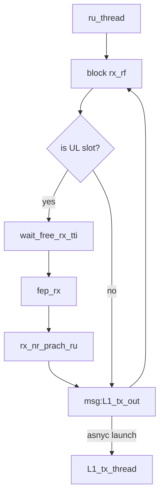
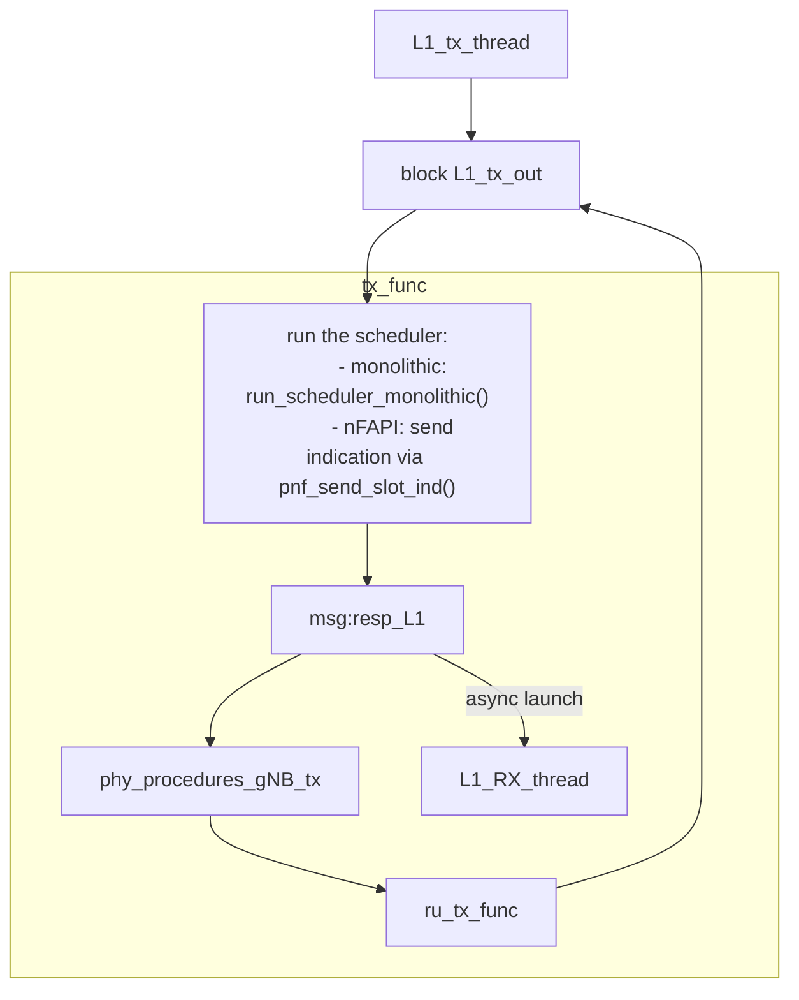
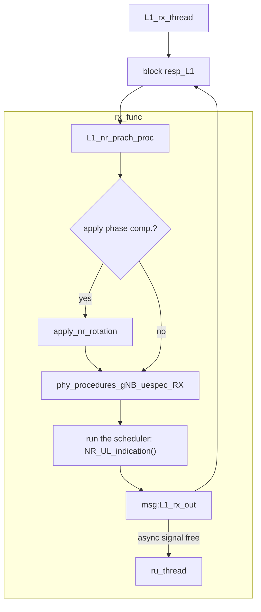

This document is a high-level overview over the L1 threading mechanism.

The main thread is `ru_thread()`. It blocks on reception of radio samples
(either time domain or frequency domain).  In the case of an UL slot, it waits
that no more than N UL jobs are scheduled (via `wait_free_rx_tti()`, which
waits on queue `L1_rx_out`, cf. the RX L1 processing further below). Then:

- if the radio is time domain-based, it performs RX front-end processing (RX
  FEP -> `fep_rx()`, i.e. DFT) to reach a frequency domain representation of
  the RX signal, as well as does DFT for PRACH.
- if the radio is frequency domain-based, nothing is done.

Afterwards, it triggers TX processing by pushing a message into the FIFO queue
`L1_tx_out`, which asynchronously starts a TX job in `L1_tx_thread()` (see
below). After that, it blocks again on reception on the radio.

The `L1_tx_thread()` processes individual TX jobs sequentially, by waiting for
new messages on queue `L1_tx_out`, signalling individual TX jobs. For each
message, it calls `tx_func()` which does in order:

- run the scheduler through `NR_slot_indication`, which corresponds to a
  "Slot.indication" in FAPI parlance. This runs the scheduler, and schedules a
  given slot (either downlink, uplink, or both).
- trigger RX processing by pushing a message into the FIFO queue `resp_L1`,
  asynchronously starting an RX job in `L1_rx_thread()` (see below).
- process the current L1 TX job through `phy_procedures_gNB_tx()`
- write to the radio board via `ru_tx_func()`.

After these steps, `tx_func()` return to `L1_tx_thread()`, which will wait for
the next TX job.

The `L1_rx_thread()` processes individual RX jobs sequentially. It waits for a
new RX job through the queue `resp_L1`, and then calls `rx_func()`, which does
in order:

- run PRACH processing via `L1_nr_prach_proc()`
- optionally apply rotation to the RX signal if phase compensation is to be
  applied
- run the current L1 RX job through (`phy_procedures_gNB_uespec_RX()`), which
  notably includes PUCCH, PUSCH, SRS processing
- call the scheduler through `NR_ul_indication()`, which corresponds to FAPI
  uplink messages (e.g., `RX_data.indication`, `CRC.indication`,
  `UCI.indication` etc.)
- signal completion via FIFO queue `L1_rx_out()`, which tells `ru_thread()`
  that RX processing finished.

The signalling of scheduler data is done through a variable `UL_INFO`, which is
filled by `L1_nr_prach_proc()` (for PRACH) and `phy_procedures_gNB_uespec_RX()`
(for PUCCH, PUSCH, SRS).

After these steps, `rx_func()` returns to `L1_rx_thread()`, which will wait the
next RX job.

Note that while individual TX (RX) jobs are run sequentially through
`L1_tx_thread()` (`L1_rx_thread()`), both TX and RX processing run in
parallel.
